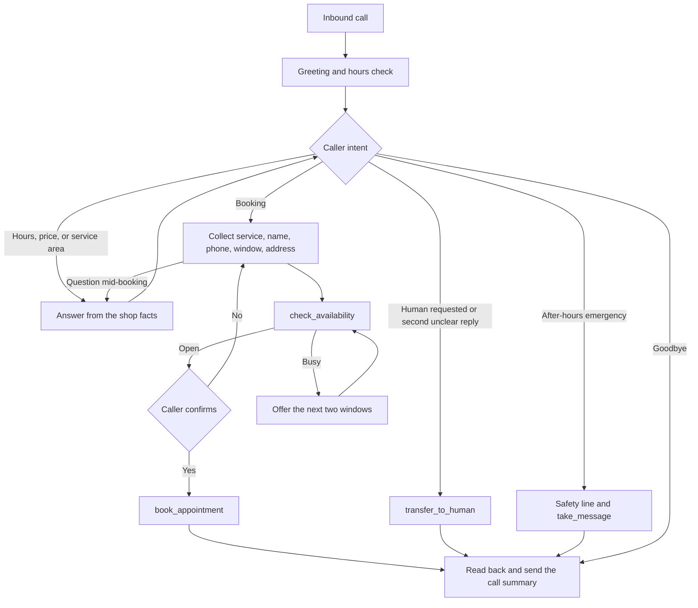

# Peak Plumbing Denver call flow

```mermaid
flowchart TD
  startNode[Inbound call] --> greet[Greeting and hours check]
  greet --> listen{Caller intent}
  listen -->|Hours, price, or service area| answer[Answer from the shop facts]
  answer --> listen
  listen -->|Booking| collect[Collect service, name, phone, window, address]
  collect -->|Question mid-booking| answer
  collect --> avail[check_availability]
  avail -->|Open| confirm{Caller confirms}
  avail -->|Busy| offer[Offer the next two windows]
  offer --> avail
  confirm -->|Yes| book[book_appointment]
  confirm -->|No| collect
  book --> summary[Read back and send the call summary]
  listen -->|Human requested or second unclear reply| transfer[transfer_to_human]
  listen -->|After-hours emergency| safety[Safety line and take_message]
  transfer --> summary
  safety --> summary
  listen -->|Goodbye| summary
```
